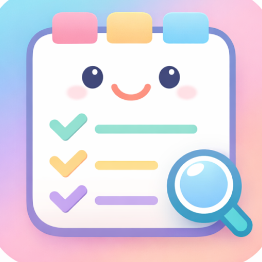

  
  <h1>Prima-Focus</h1>

  
  
  
  
  
  

 

> **Note**: This repository serves as a **Showcase**. The complete source code is kept private, but you can explore the technical documentation and download the APK to try the app yourself!

  <a href="#english">English</a> | <a href="#español">Español</a>

---

## English

### 📝 Project Description
**Prima-Focus** is a local-first task management application designed to help you focus on what truly matters. Built natively for Android, it uses an advanced predictive priority scoring system to dynamically select your "Today Task." All data is stored locally on the device for maximum privacy and performance.

### 🚀 Live Demo / Download
You can download the latest version of the app directly from the [Releases](https://github.com/AnaCataVC/prima-focus-showcase/releases) tab:
👉 **[Download APK (v1.0.0)](https://github.com/AnaCataVC/prima-focus-showcase/releases/latest)**

### 🛠️ Technologies Used
- **Language**: Kotlin
- **UI Toolkit**: Jetpack Compose (Material Design 3)
- **Local Persistence**: Room Database (SQLite)
- **Background Processing**: WorkManager & Foreground Services

### 🧠 Key Learnings
This project was a major milestone as it was **my very first time developing a native mobile application**. Throughout the process, I learned how to:
- Architect and build a complete mobile app from scratch.
- Master declarative UI design using **Jetpack Compose**.
- Implement local database persistence and migrations using **Room**.
- Handle complex background tasks and asynchronous notifications using **WorkManager** and **Foreground Services**.

### 📚 Documentation Index
Explore our comprehensive technical documentation to understand how Prima-Focus works under the hood:
- [System Architecture](docs/architecture.md)
- [Priority Logic & Scoring](docs/priority-logic.md)
- [Notification Flow](docs/notification_flow.md)
- [Database Schema](docs/database_schema.sql)
- [UI Specifications](docs/ui_spec.md)
- [Implementation Notes](docs/implementation_notes.md)
- [Learnings & Decisions](docs/learning/)

---

## Español

### 📝 Descripción del Proyecto
**Prima-Focus** es una aplicación de gestión de tareas "local-first" diseñada para ayudarte a enfocarte en lo que realmente importa. Construida nativamente para Android, utiliza un avanzado sistema predictivo de puntuación de prioridad para seleccionar dinámicamente tu "Tarea de Hoy". Todos los datos se almacenan localmente en el dispositivo para garantizar máxima privacidad y rendimiento.

### 🚀 Descarga y Demo
Puedes descargar la última versión de la aplicación directamente desde la pestaña de [Releases](https://github.com/AnaCataVC/prima-focus-showcase/releases):
👉 **[Descargar APK (v1.0.0)](https://github.com/AnaCataVC/prima-focus-showcase/releases/latest)**

### 🛠️ Tecnologías Utilizadas
- **Lenguaje**: Kotlin
- **Interfaz Gráfica**: Jetpack Compose (Material Design 3)
- **Persistencia Local**: Base de datos Room (SQLite)
- **Procesamiento en Segundo Plano**: WorkManager y Foreground Services

### 🧠 Aprendizajes Clave
Este proyecto representó un gran hito personal, ya que fue **la primera vez que desarrollé una aplicación móvil nativa**. A lo largo del proceso aprendí a:
- Diseñar y construir la arquitectura de una app móvil desde cero.
- Dominar el diseño de interfaces declarativas utilizando **Jetpack Compose**.
- Implementar almacenamiento local y migraciones con **Room**.
- Manejar tareas complejas en segundo plano y notificaciones asíncronas utilizando **WorkManager** y **Foreground Services**.

### 📚 Índice de Documentación Técnica
Explora nuestra documentación técnica completa para entender cómo funciona Prima-Focus internamente:
- [Arquitectura del Sistema](docs/architecture.md)
- [Lógica de Prioridades](docs/priority-logic.md)
- [Flujo de Notificaciones](docs/notification_flow.md)
- [Esquema de Base de Datos](docs/database_schema.sql)
- [Especificaciones de UI](docs/ui_spec.md)
- [Notas de Implementación](docs/implementation_notes.md)
- [Aprendizajes y Decisiones](docs/learning/)
