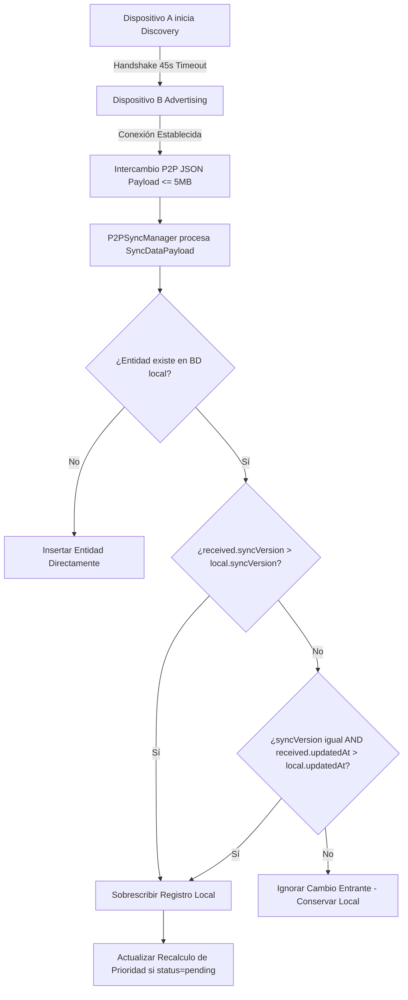

# P2P Offline Sync: Tombstones, Clock Drift & Garbage Collection (Decisión Arquitectónica)

## Contexto
Prima-Focus opera bajo una arquitectura **Local-First** estricta sin backend centralizado en la nube. La sincronización entre dispositivos (teléfono y tableta) se realiza directamente de punto a punto (P2P) mediante la API de Google Nearby Connections. En entornos descentralizados y desconectados surgen tres desafíos críticos:
1. **Resurrección de entidades borradas** cuando un dispositivo offline no conoce el borrado realizado en otro.
2. **Clock Drift (desfase de relojes locales)** que corrompe la resolución clásica de conflictos *Last-Write-Wins (LWW)* basada únicamente en `updatedAt`.
3. **Bloating / Inflación indefinida de almacenamiento** por acumulación eterna de lápidas (*tombstones*).
4. **Drenaje de batería y ataques de denegación de memoria** durante el descubrimiento P2P por radiofrecuencia.

---

## 1. Problemas Identificados y Análisis de Falla

### A. Resurrección de Entidades (The Zombie Record Problem)
Si un registro se elimina físicamente con `DELETE FROM tasks WHERE taskId = ...` en el Dispositivo A mientras el Dispositivo B está desconectado, cuando ambos se reconectan, el Dispositivo B envía su lista completa y el Dispositivo A interpreta la tarea inexistente localmente como una tarea nueva entrante, resucitándola.

### B. Vulnerabilidad de Clock Drift en LWW
En implementaciones tradicionales de LWW:
$$\text{sobrescribir si } received.updatedAt > local.updatedAt$$
Si el Dispositivo A tiene su reloj del sistema adelantado apenas 2 minutos respecto al Dispositivo B (por falta de sincronización NTP o configuración horaria manual), **todas las ediciones realizadas en el Dispositivo B son descartadas silenciosamente**, provocando pérdida irreversible de datos.

### C. Fuga de Recursos por Radiofrecuencia y Carga Útil
El escaneo continuo de Bluetooth Low Energy (BLE) y Wi-Fi Direct drena rápidamente la batería. Asimismo, la recepción descontrolada de datos sin un límite estricto de tamaño expone al cliente a desbordamientos de memoria (*OutOfMemoryError*).

---

## 2. Decisiones de Diseño e Implementación

### 1. Room Database v5 con Soft Deletes (Tombstones) y `syncVersion`
- Se actualizaron las entidades `TaskEntity` y `SessionEntity` en Room v5 con las columnas:
  - `isDeleted: Boolean` (0/1 en SQLite)
  - `deletedAt: Long?` (epoch ms)
  - `syncVersion: Long` (iniciando en 1L e incrementándose en cada modificación)
- Todas las operaciones de eliminación desde la UI ejecutan `softDeleteTask()` y `softDeleteSession()`, marcando `isDeleted = 1`, asignando `deletedAt = System.currentTimeMillis()`, y aumentando `syncVersion = syncVersion + 1`.
- Las consultas activas filtran explícitamente `WHERE isDeleted = 0`.

### 2. Resolución de Conflictos LWW Blindada (*Version-Aware Last-Write-Wins*)
En `TaskDao.syncMergeTasksAtomic()` y `SessionDao.syncMergeSessionsAtomic()`, la evaluación de precedencia implementa una jerarquía de 2 niveles:
```kotlin
val shouldUpdate = when {
    received.syncVersion > local.syncVersion -> true
    received.syncVersion == local.syncVersion && received.updatedAt > local.updatedAt -> true
    else -> false
}
```
- **Ventaja:** Si un dispositivo tiene desfase de reloj pero ha realizado más ediciones (`syncVersion` superior), su estado prevalece inequívocamente sobre un reloj adelantado artificialmente.

### 3. Purga Automática de 30 Días (Garbage Collection de Tombstones)
Para evitar el crecimiento indefinido de la base de datos local:
- Se implementó la consulta:
  ```sql
  DELETE FROM tasks WHERE isDeleted = 1 AND deletedAt IS NOT NULL AND deletedAt < :cutoffTimestamp
  ```
- Al inicializar `TaskViewModel`, se calcula `thirtyDaysAgo = System.currentTimeMillis() - (30L * 24 * 60 * 60 * 1000)` y se ejecutan atómicamente `taskDao.purgeOldTombstones()` y `sessionDao.purgeOldTombstones()`.
- **Ventaja:** Los 30 días garantizan tiempo suficiente para que dispositivos emparejados esporádicamente sincronicen la lápida antes de su eliminación física permanente.

### 4. Protecciones de Batería y Seguridad en `P2PSyncManager`
- **Auto-Timeout de 45 segundos:** `AUTO_TIMEOUT_MS = 45000L` cancela automáticamente el estado de anfitrión (*Advertising*) o búsqueda (*Discovery*) si no se establece conexión, evitando el agotamiento de la batería por radio activa.
- **Límite de Carga de 5MB:** `MAX_PAYLOAD_BYTES = 5 * 1024 * 1024L` valida el tamaño del payload entrante y saliente antes de su procesamiento Gson, rechazando cargas anómalas.
- **Identificación Clara de Dispositivo:** Se publica `Build.MODEL` (truncado a 25 caracteres) en lugar de IDs hexadecimales opacos para una experiencia de emparejamiento predecible e intuitiva.

---

## 3. Diagrama de Flujo de Sincronización y Merge LWW


