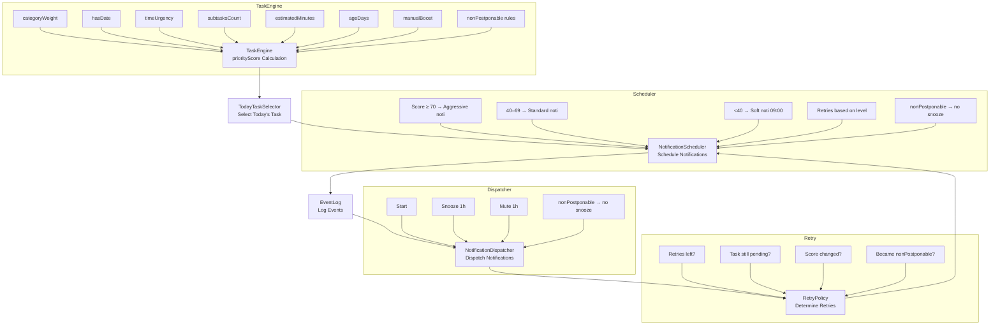

# Notification Flow

## Defined Infrastructure
**Android**: Kotlin, Room, WorkManager, ForegroundService, NotificationManager.

## Configurable WorkManager Frequency
The app uses a `PeriodicWorkRequest` (`NotificationWorker`) mapped directly to the user's settings (via `SharedPreferences` `notification_frequency`).
- **Dynamic Rescheduling**: When the user updates the frequency from the `SettingsScreen` (e.g. 15m, 30m, 1h, 2h), the `TaskViewModel` uses `ExistingPeriodicWorkPolicy.REPLACE` to update the worker instantly.
- **Off State**: If the frequency is set to `0` or `< 0` (Apagadas), the system executes `workManager.cancelUniqueWork("NotificationWorker")`, stopping background jobs completely to respect user boundaries and battery life.
